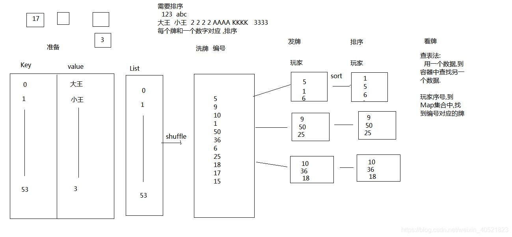

# **README**

## 1.任务(可选)

1.可以尝试做个三人机斗地主玩玩，比如整副牌就可以作为一个类，那么一张牌就可以作为一个内部类，人机打牌策略可以用接口等等
2.可以尝试用反射做个json，至于什么是json百度吧
3.自己用泛型做个兼容性的强的容器，容器就是java内自带的ArrayList、map之类的，我们也可以自己做一个简化版玩玩。

## CSA_WORK3-----三人机斗地主

1.要求: 需要使用到泛型,反射,接口,继承,多态

2.思路: 比如整副牌就可以作为一个类，那么一张牌就可以作为一个内部类，人机打牌策略可以用接口等等

斗地主过程: 组合牌-->洗牌-->发牌-->看牌

原理图:

参考链接https://blog.csdn.net/weixin_40521823/article/details/84144861

3.

